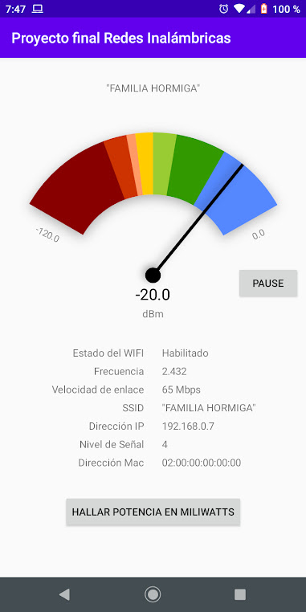
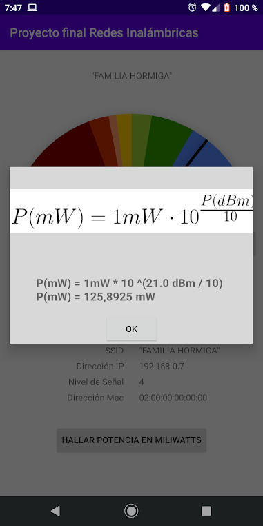

# Android-WIFI-Information-and-dBm-Meter

This app shows the Wifi signal strength in dBm and mW. It also shows Wifi information obtained from Android Wifi Service.
This app was made as a little project for the subject "Redes Inalámbricas" that i coursed at my university. 

License
----

MIT

**Free Software, Hell Yeah!**
